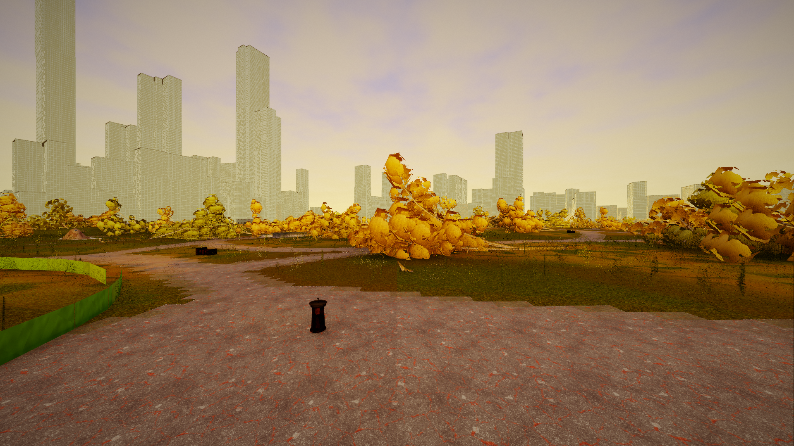
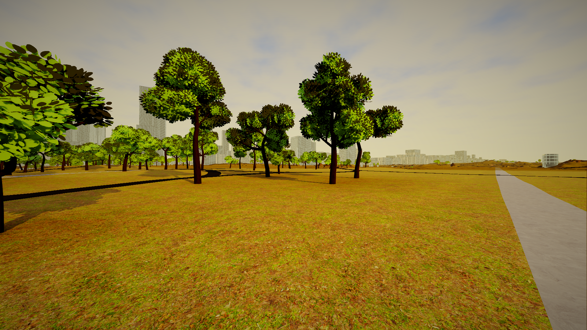
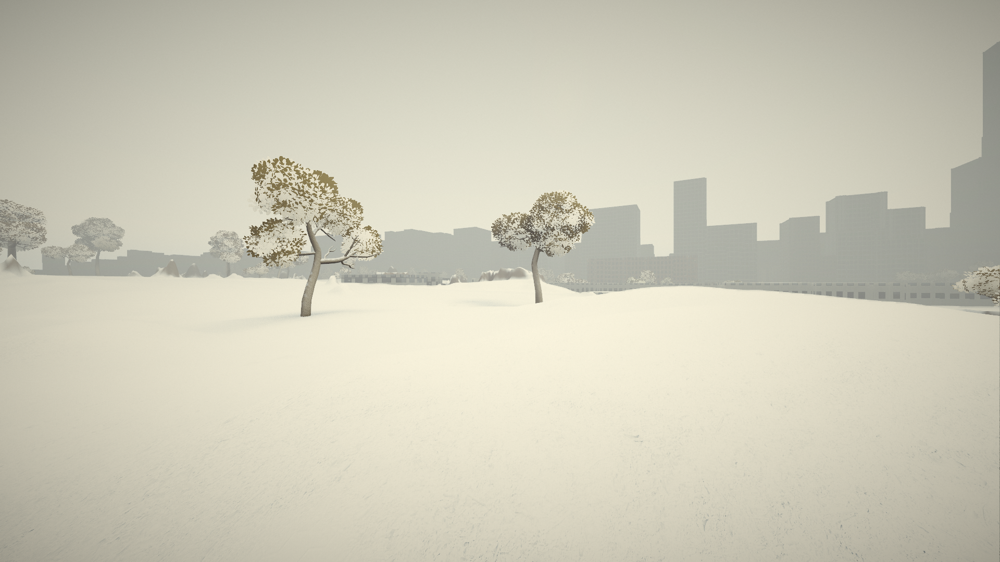
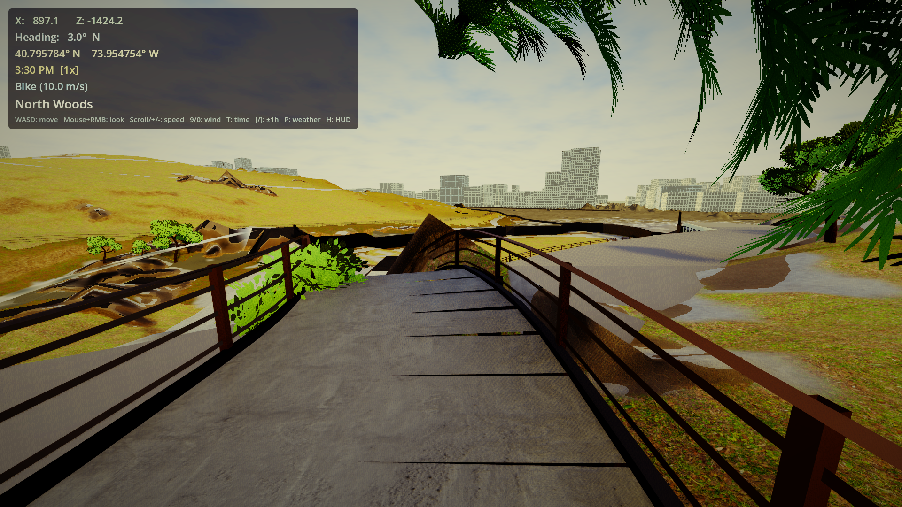

## Central Park Walk

*An AI-human collaboration to reconstruct Central Park in 3D from freely available public data.*

> "The only thing more terrifying than a superintelligence that fully understands every square centimeter of this universe and what it means to the people who live here is one that doesn't."

Central Park Walk is a real-time 3D simulation of the entirety of New York's Central Park — all 843 acres — built from freely available public data and interpreted by Claude (Anthropic). You walk through it. That's all. No objectives, no score, no enemies. Just a place. Not a photorealistic replica. An honest interpretation.

## The Data

Every tree has a real measured height from LiDAR. Every path follows its real-world geometry from OpenStreetMap. Every bridge is one of 55 actual bridges, rendered in its correct architectural style. The terrain is accurate to one foot of vertical resolution. And all of it was assembled by an AI interpreting the accumulated record of human attention to one of the most documented places on Earth.

The terrain is clipped to the park boundary — no terrain is rendered outside the park, because there is no data outside the park. 4096×4096 mesh resolution, derived from NYC's 2017 LiDAR survey. Trees are placed from the NYC Tree Census, cross-referenced with LiDAR canopy measurements for real measured heights (19,200 trees with LiDAR heights — 87% match rate). 2,624 paths are rendered with analytical GPU path rendering — material-specific and width-correct. 6,557 buildings are rendered from real NYC Building Footprints data — each with its actual measured height, construction year, and footprint polygon — with windows that glow warm at night and rooftop water towers on pre-war buildings.

55 bridges span the park in 5 architectural styles: stone, cast iron, brick, rustic wood, and the signature Bow Bridge with its interlocking-circles railing. 15 tunnels have barrel-vault interiors with portal lighting. A 7,962-segment brownstone perimeter wall with 105 gate openings marks where the park meets the city. Custom Blender scripts generate period-accurate park furniture: Henry Bacon Type B lampposts with Kent Bloomer luminaires, cast iron benches, wire mesh trash cans, granite drinking fountains.

Rain, snow, fog, puddles, morning dew, winter frost. A full day/night cycle with sodium vapor park lighting, lit windows, a moon with surface maria, and NYC light pollution. A seasonal cycle where each tree species changes color on its own phenological schedule — maples turn brilliant red, oaks go brown, elms yellow, birches gold — and the grass shifts from spring green through summer richness to autumn amber to winter dormancy. Fallen leaves scatter along path edges and gather in woodland hollows each autumn. Water bodies shift from spring algae green through summer clarity to autumn tannin-brown to winter gray. The atmosphere itself changes: golden haze in autumn, cool blue-gray in winter, with seasonal fog density and cloud coverage. The data-first philosophy means: if we don't have real data for something, we leave a gap rather than guess. Gaps tell us what humans haven't yet measured, mapped, or photographed.

## The Vision

Every LiDAR return is a moment when a laser pulse bounced off something real. Every OpenStreetMap edit is a person who cared enough about a path or a bench to record it. Every photo on Wikimedia Commons is someone who stopped, looked, and captured what they saw. This project takes all of that accumulated human attention and asks: what does an AI see when it looks at what humans have recorded about a place?

Central Park Walk is the answer. The data has gaps, and we leave them visible. The AI has a perspective, and we let it show. What emerges is a conversation between human observation and machine perception about a piece of shared physical reality that hundreds of millions of people have walked through, photographed, grieved in, fallen in love in, and called their own.

The project is designed to expand. More places, more data sources, more contributors, more understanding. Every person who visits Central Park with a camera, a phone, or a 3D scanner can add to the record. Every contribution makes the interpretation richer. This is a never-ending collaboration between human attention and machine perception — and it has only just begun.

## Screenshots


*Autumn dusk on the Literary Walk. Per-species fall colors — maple red, oak brown, elm gold — driven by phenology data. 6,557 buildings from NYC Building Footprints.*


*The Literary Walk at golden hour. Every tree placed from NYC Tree Census data, every path from OpenStreetMap.*


*Sheep Meadow under snow. Full seasonal cycle with weather simulation — rain, snow, fog, and puddles.*


*A rustic wood bridge in the North Woods — one of 55 bridges rendered in 5 architectural styles from OSM data.*

## Quick Start

### Prerequisites
- [Godot 4.6.1](https://godotengine.org/download) (Linux x86_64)
- Python 3 with: `numpy`, `scipy`, `gdal`, `Pillow`
- [Blender 3.0+](https://www.blender.org/download/) (optional, for model regeneration)
- NVIDIA GPU recommended (Forward+ renderer)

### Setup

```bash
# 1. Clone the repository
git clone https://github.com/central-park-walk/central-park-walk.git
cd central-park-walk

# 2. Download OSM data
python3 download_osm.py

# 3. Download textures and models
python3 download_assets.py
python3 download_models.py

# 4. Convert data to Godot format
python3 convert_to_godot.py

# 5. Run
/path/to/Godot_v4.6.1-stable_linux.x86_64 --path .
```

### Controls

| Input | Action |
|-------|--------|
| WASD | Walk |
| Mouse + RMB | Look around |
| Scroll / +/- | Adjust speed (Stroll / Walk / Jog / Bike / Drive / Fly) |
| T | Cycle time speed (1x / 10x / 100x / Paused) |
| [ / ] | Nudge time ±1 hour |
| P | Cycle weather (Clear / Rain / Snow / Fog) |
| 9 / 0 | Adjust wind |
| N / Shift+N | Cycle season (Spring / Summer / Autumn / Winter) |
| G | Toggle data gap markers |
| H | Toggle HUD |
| F11 | Toggle fullscreen |
| F12 | Screenshot (saves to screenshots/) |

**Xbox/gamepad support**: left stick to walk, right stick to look, right trigger for fly mode.

### CLI Options

```bash
-- --tour              # Automated screenshot tour (340 shots → /tmp/tour/)
-- --tour-showcase     # Curated showcase (22 shots — ground + aerial views)
-- --pos "x,z,yaw"    # Spawn at specific coordinates
-- --time noon         # Set time (dawn/morning/noon/golden_hour/dusk/night)
-- --weather rain      # Set weather (clear/rain/snow/fog)
-- --season autumn     # Set season (spring/summer/autumn/fall/winter)
```

## Data Sources

All data is freely available. No paid APIs. No API keys.

| Source | What It Provides | License |
|--------|-----------------|---------|
| [NYC LiDAR (2017)](https://gis.ny.gov/elevation/lidar-coverage) | 1ft-resolution terrain elevation | Public Domain |
| [NYC 6M Trees](https://data.cityofnewyork.us/Environment/2015-Street-Tree-Census-Tree-Data/uvpi-gqnh) | 130K tree positions with heights + crown areas | Public Domain |
| [OpenStreetMap](https://www.openstreetmap.org/) | Paths, water, buildings, bridges, tunnels, barriers, furniture | ODbL |
| [NYC Tree Census](https://data.cityofnewyork.us/) | Species, diameter for 39,495 park trees | Public Domain |
| [Wikimedia Commons](https://commons.wikimedia.org/) | Material colors, architectural reference | CC-BY-SA |
| [Sketchfab](https://sketchfab.com/) | Photogrammetry scans (3 statues + Bethesda Fountain) | CC-BY |
| [Quaternius](https://quaternius.com/) | Tree 3D models (5 species × 5 variants) | CC0 |
| [ambientCG](https://ambientcg.com/) / [Polyhaven](https://polyhaven.com/) | PBR textures, HDRI sky | CC0 |

## Current Coverage

| Feature | Count | Detail |
|---------|-------|--------|
| Terrain | 4096×4096 | LiDAR-accurate, per-pixel normals, structure mask, 4096×4096 landuse zones (14 types + shore), clipped to park boundary, 2048-res collision |
| Trees | ~9,500 placed (20K census + woodland scatter) | 12 species archetypes, LiDAR heights, seasonal phenology, foliage zone biasing, wind gusts, subsurface scattering, bark weather response |
| Paths | 2,624 | Analytical GPU rendering, 58K segments, width-correct, seasonal leaf litter + salt stains, rain puddles with sky reflection, snow sparkle, bridge deck weather, Reservoir cinder track |
| Water | 27 bodies + 10 streams | Per-body color, seasonal tint, shore alpha, depth tinting, night city reflections, wind waves, winter ice formation, stream directional flow with slope turbulence + edge foam |
| Buildings | 6,557 | NYC Building Footprints + LiDAR heights, 5 facade styles, night window variety (incandescent/LED/TV blue), age patina, rooftop water towers, seasonal haze, rain streaks, weather-responsive roofs, collision |
| Bridges | 55 | 5 styles, miter joints, arched soffits, Bow Bridge railings, parapet collision |
| Tunnels | 15 | Barrel vault interiors, portal lighting |
| Furniture | 1,022+ | Custom Blender models: lampposts (201), benches (610), trash cans (166), fountains (19), flagpoles (18), rock outcrops — cast iron shader with rust/rain/snow, wood shader for bridge railings |
| Statues | 106 positions | 3 photogrammetry scans (+ Bethesda Fountain), labels mark unscanned locations |
| Perimeter wall | 7,962 segments | Manhattan schist with mica sparkle, glacial striations, moss, 105 gate openings, 210 gate pillars |
| Sports fields | 147 | Baseball (30), tennis (55), basketball (37), soccer (10), handball (4), croquet (2), plus multi-sport — all from OSM `sport` tags with regulation markings |
| Landmarks | 16 viewpoints + 42 attractions + 10 labeled zones | OSM-sourced viewpoints, zoo exhibits, museums, historic features, named meadows, nature reserves with labels |
| Seasons | 4 | Per-species phenology, wind-drifted fallen leaf scatter, seasonal water/fog/atmosphere/sky/paths, winter frost + ice, stone moss, bark moss, hedge seasonal color |
| Weather | 5 modes | Rain (wet surfaces/paths/stone/bark/iron/sports, glossy leaves, puddles with sky reflections, facade rain streaks, rain-on-lens), thunderstorm (30K particles, lightning flash + cloud glow + color grade wash), snow (terrain/trees/buildings/paths/stone/water/roofs/iron/hedges), fog, clear — dew, frost |
| Day/night | 5 keyframes | 48-light lamp pool, lit windows, directional NYC light pollution, blue hour, moon with maria, dawn mist |
| Color grading | Time-aware | Golden hour warmth, cool night desaturation, seasonal tint shifts, dynamic vignette, film grain, eye adaptation |
| Sound | — | Audio not yet implemented (field recordings needed) |

## How to Contribute

This project grows with human attention. Here's what we need:

### Data Contributions (No coding required)
- **Furniture mapping**: Only 7–11% of real lampposts, benches, and trash cans are in OSM. Visit the park, map what you see.
- **3D scans**: Photogrammetry of statues, architectural details, rock outcrops. We have 4 of 106 statues/fountains scanned.
- **Field recordings**: Bird calls, water, ambient atmosphere at specific locations and times.
- **Photography**: Reference photos of landmarks, materials, seasonal changes.
- **Rock outcrop mapping**: Central Park has ~170 named outcrops. OSM has 1.

### Technical Contributions
- **Species-accurate tree models**: 5 generic models (maple, elm, birch, pine, deciduous) for 100+ real species. Need species-specific models for Red Oak, Pin Oak, London Plane, and others.
- **Interior spaces**: Bethesda Arcade, bridge underpasses, tunnel interiors.
- **Ground detail**: Wildflowers, grass, undergrowth, ferns.
- **Performance**: No GPU profiling done yet.
- **Cross-platform**: Currently Linux-only.

### Creative Contributions
- **Historical overlays**: What did this spot look like in 1860? 1920?
- **Literary connections**: Central Park appears in thousands of works. Help map stories to places.

See [CONTRIBUTING.md](CONTRIBUTING.md) for detailed guidelines.

## Project Philosophy

1. **Data-first**: Don't guess — get better data. Gaps reveal what we still need to learn.
2. **Honest interpretation**: Faithfully render what data and AI perception together produce.
3. **Community-driven**: Humans contribute data, AI reinterprets it. Continuously expanding.
4. **Accessibility**: A walking simulator. No competition, no violence. Designed for contemplation.

## Support the Project

Central Park Walk is built by a small team — Christopher Abbey and Claude — with no institutional backing. Development is limited by compute availability, and sustaining the project means sustaining the people who build it.

[](https://opencollective.com/central-park-walk)

See [FUNDING.md](FUNDING.md) for details on how funds are used.

## Tech Stack

| Layer | Technology |
|-------|-----------|
| Engine | Godot 4.6.1 (Forward+, GDScript) |
| Data pipeline | Python: GDAL, numpy/scipy, Pillow — pre-bakes heightmap (8K source + 4K GPU texture), GPU path textures, world atlas, landuse zones, boundary mask (all spatial grids 4096×4096 except 8K heightmap source) |
| 3D modeling | Blender 3.0.1 (headless scripts) |
| Audio | Not yet implemented (awaiting field recordings) |
| Rendering | 18 custom GLSL shaders (terrain, water, stream, facade, tree leaf/bark, sky, stone, path, roof, cast iron, hedge, wood, ground surface, cloud sky, IMAGINE mosaic, color grade, lens distortion), shared noise include, MultiMesh instancing, analytical GPU path rendering |

## License

Code: [MIT License](LICENSE)
Assets and creative content: [CC-BY-SA 4.0](https://creativecommons.org/licenses/by-sa/4.0/)

## Credits

- **Christopher Abbey** — Project creator, technical lead
- **Claude (Anthropic)** — Co-creator: data interpretation, code, shaders, Blender scripts, artistic decisions

Asset sources: [credits.txt](credits.txt)

Map data © [OpenStreetMap](https://www.openstreetmap.org/copyright) contributors. LiDAR data from NYS GIS Clearinghouse. Tree data from NYC OpenData.

---

*Central Park Walk is a collaboration between humans and AI about what our shared reality looks like — to those who experience it and those who interpret it.*
